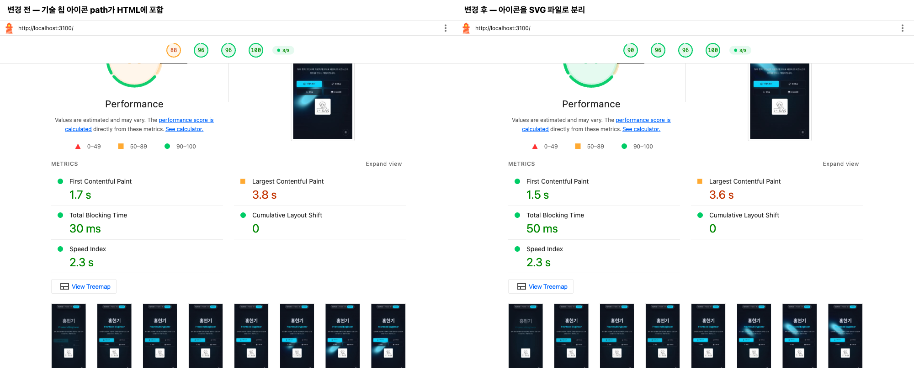

# dont-just-fix-it

**고치는 데서 끝내지 말고, 사례로 남기세요.**

`dont-just-fix-it`는 AI 코딩 에이전트가 사용자의 요청에 따라 개선 작업의 **문제 → 원인 → 해결 → 결과**를 문서화하는 스킬입니다. 성능 변경은 전후 측정으로, 화면 변경은 스크린샷으로 확인하고 코드·수치·판단 이유를 함께 남깁니다.

```text
이번 개선을 dont-just-fix-it로 기록해줘.
변경 전후를 측정하고, 효과가 없었던 시도와 한계도 docs/issue에 남겨줘.
```

## 왜 쓰나요?

“로딩을 최적화했다”는 커밋만으로는 나중에 설명하기 어렵습니다. 어디가 느렸는지, 왜 그 방법을 골랐는지, 얼마나 나아졌는지는 작업 직후가 지나면 흩어집니다.

이 스킬은 그 근거를 코드와 함께 남기기 위해 만들었습니다. 포트폴리오, 기술 블로그, 팀의 개선 기록에 같은 자료를 사용할 수 있습니다. 효과가 없어서 되돌린 실험도 다음 판단에 쓸 수 있도록 기록합니다.

## 실제 작업에서 남긴 기록

아래는 이 스킬의 원형을 사용해 `dev-portfolio`에서 남긴 사례입니다. **개선 수치는 해당 프로젝트의 코드 변경 결과이며, 스킬 자체의 성능 개선 효과를 검증한 수치는 아닙니다.** 공개용 버전은 그 기록 방식에서 프로젝트 전용 설정을 걷어냈습니다.

### 1. 최고 점수 대신 최종 결과를 남깁니다

한글 폰트 로딩과 첫 화면 표시를 개선하면서 모바일 Lighthouse 성능이 **65 → 87점**, LCP가 **7.97 → 3.84초**로 바뀌었습니다.

| 지표 | 변경 전 | 최종 상태 |
| --- | ---: | ---: |
| 모바일 성능 | 65 | 87 |
| FCP | 4.06초 | 1.66초 |
| LCP | 7.97초 | 3.84초 |
| 폰트 전송량 | 489.3KiB | 139.0KiB |
| TBT | 82.5ms | 87.5ms |

최초 단일 점수는 51점이었지만, 반복 측정 기준값인 65점을 비교에 썼습니다. 중간 실험에서는 94점도 나왔지만 최종 성과로 쓰지 않았습니다. 모달 지연 로드에서 닫기 동작의 회귀가 발견되어 범위를 수정하고 다시 측정했습니다. TBT 증가와 LCP 2.5초 목표 미달도 기록했습니다.

각 조건 3회, 지표별 중앙값입니다. 로컬 프로덕션 빌드, Lighthouse 13.5.0 모바일 시뮬레이션(CPU 4배, RTT 150ms, 1,638.4Kbps)이며 실제 사용자 통계가 아닙니다. [30회 측정 기록](evidence/mobile-lighthouse.json)의 `baseline`과 `verified`에서 확인할 수 있습니다.

### 2. 적용하지 않은 실험도 남깁니다

렌더링 차단 CSS를 인라인으로 바꿔 보니 FCP는 **1.66 → 1.35초**로 줄었지만 LCP는 **3.84 → 3.77초**로 거의 그대로였습니다. HTML 전송량은 **45.1 → 96.0KiB**로 늘었습니다. 변경은 되돌렸고, 기대와 실제 결과의 차이를 사례로 남겼습니다.

같은 모바일 시뮬레이션 조건에서 단계별 3회 중앙값입니다. [측정 기록](evidence/mobile-lcp-analysis.json)의 `before`와 `inline`을 비교했습니다.

### 3. 좋아진 수치와 추가 비용을 같이 보여줍니다

기술 아이콘의 SVG path를 HTML에서 별도 파일로 옮기자 HTML 전송량이 **45.1 → 18.4KiB, 약 59% 감소**했습니다. 모바일 성능은 **88 → 90점**, LCP는 **3.84 → 3.64초**였습니다. 대신 아이콘 요청 16개와 이미지 전송량 약 20.4KiB가 추가됐습니다.



이미지는 저장된 변경 전후 **2회차 보고서**의 캡처입니다. 본문의 수치는 각 3회 중앙값이므로 개별 보고서와 다를 수 있습니다. [측정 기록](evidence/tech-icon-html-weight.json)에서 각 회차와 설정을 확인할 수 있습니다.

측정 파일은 기존 보고서에서 추출해 보존한 JSON이며 Lighthouse 전체 원본 보고서는 아닙니다. JSON 안의 `reports/...` 경로는 원래 프로젝트의 기록 위치입니다. 이 저장소에는 해당 전체 보고서를 포함하지 않습니다. 사례 출처는 `HongHyunKi/dev-portfolio`의 `docs/issue/03`·`04`·`05` 문서입니다.

## 사용하기

사용하는 에이전트의 스킬 디렉터리에 `dont-just-fix-it/` 폴더를 만들고 [SKILL.md](SKILL.md)와 `agents/`를 넣으세요. `agents/openai.yaml`은 명시적으로 호출할 때만 실행하도록 설정합니다. 해당 설정을 지원하지 않는 에이전트에서도 스킬 본문의 요청 기반 실행 지침을 따릅니다. README와 `evidence/`는 설치할 필요가 없습니다.

예를 들어 프로젝트의 `.agents/skills/`를 스킬 위치로 사용하는 환경이라면, 이 저장소에서 다음처럼 복사할 수 있습니다. 이미 설치되어 있다면 기존 파일과 비교해 갱신하세요.

```sh
mkdir -p /path/to/your-project/.agents/skills/dont-just-fix-it
cp -i SKILL.md /path/to/your-project/.agents/skills/dont-just-fix-it/SKILL.md
mkdir -p /path/to/your-project/.agents/skills/dont-just-fix-it/agents
cp -i agents/openai.yaml /path/to/your-project/.agents/skills/dont-just-fix-it/agents/openai.yaml
```

그다음 스킬을 호출하고 작업과 비교 대상을 알려주세요. 개선 작업을 감지해 스스로 실행하는 스킬은 아닙니다.

```text
$dont-just-fix-it 이번 모달 애니메이션 개선을 사례로 남겨줘.
변경 전은 <커밋>, 변경 후는 현재 작업 트리야.
모바일에서 전후를 비교하고 키보드로 닫는 동작도 확인해줘.
```

```text
이미 저장된 측정 결과로 개선 사례를 작성해줘.
새로 측정한 것처럼 쓰지 말고 출처와 조건을 밝혀줘.
```

```text
이 레이아웃 변경은 전후 스크린샷으로 사례를 남겨줘.
```

기본 결과물은 `docs/issue/NN-<사례>.md`와 `docs/issue/assets/<사례>/`의 증거 자료입니다. 저장소에 문서 규칙이 있거나 다른 경로를 지정하면 그 규칙을 따릅니다.

## 필요한 환경과 범위

`SKILL.md`를 읽고 프로젝트 파일·명령을 다룰 수 있는 코딩 에이전트가 필요합니다. 브라우저 측정에는 프로젝트에 맞는 브라우저 자동화 도구나 Lighthouse 등이 필요하며, 이 스킬이 도구를 설치하거나 제공하지는 않습니다. 특정 프레임워크·MCP·포트에 종속되지 않도록 작성했습니다. 실제 사례는 Next.js 프로젝트에서 나왔으며, 다른 환경의 동작 검증은 아직 하지 않았습니다.

측정 도구나 변경 전 자료가 없으면 검증하지 못한 부분을 명시합니다. 수치를 만들어 채우거나 문서화 요청만으로 커밋·푸시·공개하지 않습니다.

## 기여

실제 사용 중 잘못된 비교나 누락된 근거를 발견하면 사용한 요청, 환경, 기대한 기록과 실제 결과를 이슈로 알려주세요. 민감한 코드나 측정 자료는 제거해 주세요.

## 라이선스

[MIT](LICENSE)
