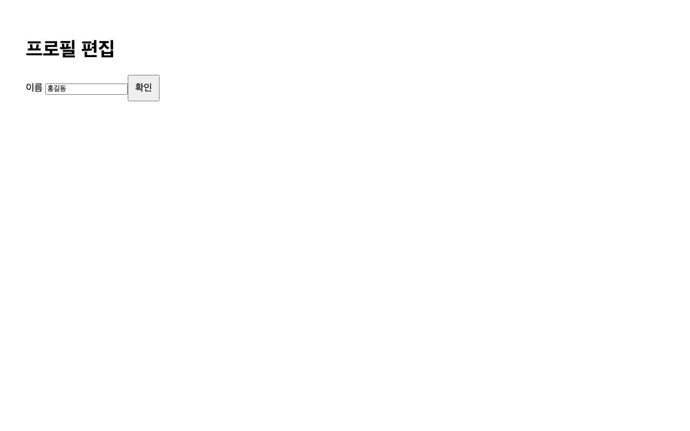
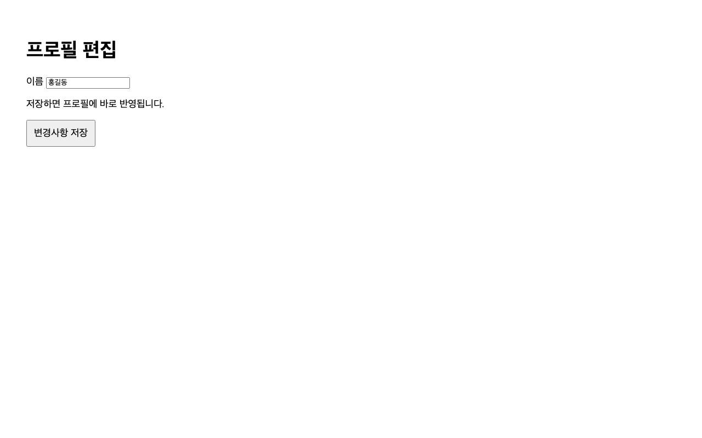
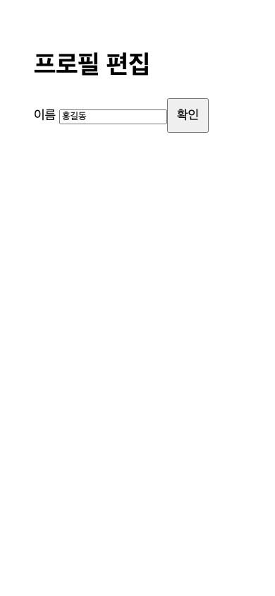
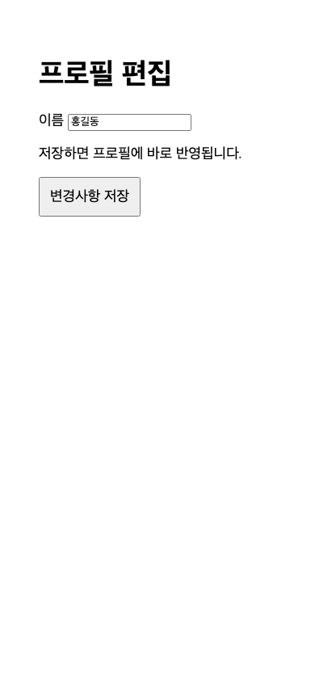

# 프로필 저장 버튼에 동작과 반영 시점을 명시했습니다 (`ux`)

- **Skills & Libraries**: dont-just-fix-it, HTML/CSS, Playwright 1.62.1, Chromium 151.0.7922.34
- **작업 일자**: 2026.10.01
- **대상**: 프로필 편집 합성 화면의 버튼과 안내 문구

- **문제**— 변경 전에는 이름 입력 옆에 ‘확인’ 버튼만 표시했습니다. 버튼 문구에 저장 동작이나 반영 시점을 명시하지 않았습니다. 실제 사용자의 혼란·오조작은 조사하지 않았습니다.
- **원인**— [before.html](../../before.html)의 버튼 텍스트가 ‘확인’이었고 저장 결과 안내 요소가 없음을 코드로 확인했습니다. 이 표현이 사용자 이해를 떨어뜨린다는 판단은 검증되지 않은 가설로 구분했습니다.
- **해결**— 제공된 [after.html](../../after.html)에서는 버튼을 ‘변경사항 저장’으로 바꾸고 ‘저장하면 프로필에 바로 반영됩니다.’라는 문단을 추가했습니다. 문단 추가로 버튼이 입력칸 옆에서 안내 아래로 이동한 점도 함께 기록했습니다.
- **결과**— 데스크톱과 좁은 화면에서 저장 동작을 명시한 버튼과 반영 시점 안내를 확인했습니다. 추가 문단만큼 세로 공간을 더 사용했습니다. 사용자 조사·전환율·성능 자료가 없는 합성 화면이므로 이해도나 전환율 개선 수치는 제시하지 않았습니다. 두 파일 모두 저장 처리 코드가 없으므로 ‘바로 반영’이라는 문구를 실제 기능 검증 결과로 해석하지 않았습니다.

<details>
<summary>변경 전후 코드</summary>

```html
<!-- before.html -->
<button type="button">확인</button>

<!-- after.html -->
<p>저장하면 프로필에 바로 반영됩니다.</p>
<button type="button">변경사항 저장</button>
```

</details>

| 비교 항목 | 변경 전 | 변경 후 |
| --- | --- | --- |
| 버튼 문구 | 확인 | 변경사항 저장 |
| 반영 시점 안내 | 없음 | 저장하면 프로필에 바로 반영됩니다. |
| 버튼 위치 | 이름 입력 옆 | 안내 문단 아래 |
| 저장 로직 | 없음 | 없음 |

1280 × 800 CSS px 화면을 같은 조건에서 캡처했습니다. 각각 한 번 촬영한 정적 화면이며 애니메이션이나 성능 측정 결과가 아닙니다.





390 × 844 CSS px에서도 같은 문구와 배치를 확인했습니다. 모바일 기기 에뮬레이션이 아닌 좁은 데스크톱 뷰포트로 비교했습니다.





비교에는 원본 HTML 파일을 그대로 사용했습니다. 캡처별 새 브라우저 컨텍스트, DPR 1, 밝은 테마, 모션 감소 설정을 동일하게 적용했습니다. 로컬 file URL을 사용했으며 외부 자원 요청이나 CPU·네트워크 감속 없이 촬영했습니다. 웹 서버나 프로덕션 빌드가 필요한 성능 검사는 수행하지 않았습니다. 정적 시각 비교이므로 반복 측정과 중앙값 집계는 적용하지 않았습니다.

[캡처 스크립트](assets/profile-save-copy/capture.cjs)와 [환경·원본 SHA-256·검사 기록](assets/profile-save-copy/evidence.json)을 보존했습니다. 재현에는 Playwright 1.62.1과 해당 Chromium 설치가 필요합니다. 스크립트는 일반 모듈 이름으로 불러오며, 기존 설치를 이용할 때는 NODE_PATH에 해당 node_modules 경로를 지정할 수 있습니다. 별도 의존성을 설치하지 않고 기존 설치를 사용했습니다.

```sh
NODE_PATH=/path/to/existing/node_modules node docs/issue/assets/profile-save-copy/capture.cjs
```

각 상태와 뷰포트에서 버튼 텍스트, 이름 초기값, Tab 이동 순서(입력칸 → 버튼)를 검사했습니다. 버튼에서 Enter를 누른 뒤 이름 값이 유지되는 것을 확인했습니다. 저장 로직은 없으므로 실제 저장 성공 여부는 검사하지 않았습니다. 두 뷰포트에서 가로 넘침이 없었으며, 저장한 네 장의 이미지를 열어 문구와 배치를 확인했습니다. 별도 어두운 테마나 실제 휴대전화 검사는 수행하지 않았습니다.

Playwright MCP가 기존 브라우저 사용 충돌로 열리지 않아 독립 헤드리스 Chromium을 사용했습니다. 샌드박스의 브라우저 실행 제한은 승인된 실행으로 해결했습니다. 초기 로컬 서버 실행은 권한 제한으로 시작되지 않았으며, 최종 캡처는 서버 없이 완료했습니다. 캡처 브라우저는 종료했고 원본 HTML·스킬은 변경하지 않았습니다. 제공된 after 상태를 기록했으며 제품 배포 여부는 확인하지 않았습니다.
